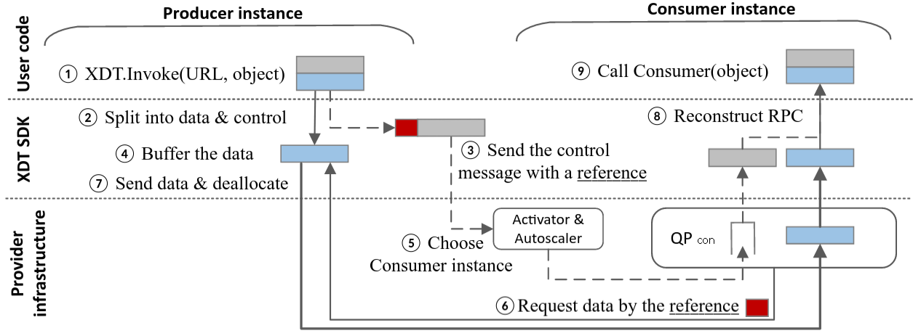

### Code for [Expedited Data Transfers for Serverless Clouds](https://arxiv.org/abs/2309.14821) 

### Design
<!-- insert image -->


### Structure of the repository
SDK: Contains the SDK for the source and destination functions. The SDK is written in golang and Python. The SDK is used by the source and destination functions to communicate directly.

Proxy: Contains the proxy server. The proxy server is written in golang. The proxy server is used by the destination function's queue proxy to fetch the data from the source function to recreate the request.

### Prerequisites
Golang 1.18 or higher
Python 3.8 or higher (only for python SDK)

### Run

1. Get a kuberneter cluster with knative installed. Follow the instructions [here](https://knative.dev/docs/install/any-kubernetes-cluster/) to install knative on a kubernetes cluster. We used [vhive](https://github.com/vhive-serverless/vhive) cluster for our experiments.

2. Build yamls for XDT enabled knative cluster
```bash
# clone the repo
git clone https://github.com/shyamjesal/serving
cd serving
# checkout the xdt branch
git checkout main_xdt_release-1.4
# build the yamls using the generate-yamls.sh script
export YAML_LIST=$(mktemp) && export REPO_ROOT_DIR=$(pwd) && ./hack/generate-yamls.sh "${REPO_ROOT_DIR}" "${YAML_LIST}"
```
3. apply the yamls
```bash
# The above command will generate a list of yamls in the temp directory. Apply the serving code and serving crds yamls using the following command
kubectl apply -f <FileName.yaml>
```
4. Deploy the source function
```bash
# Clone the vswarm repo
git clone https://github.com/vhive-serverless/vswarm
cd vswarm
# deploy the chained-function-serving benchmark with XDT configuration and run the benchmark
